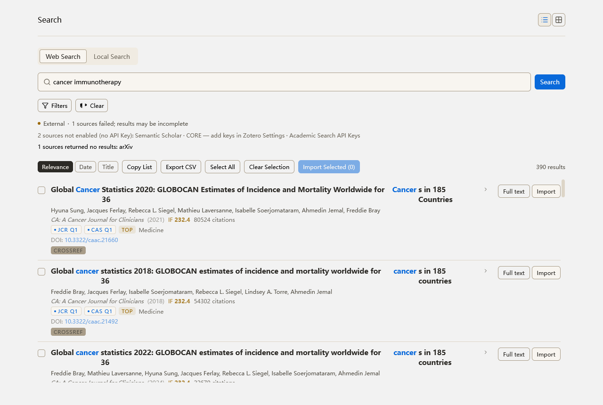
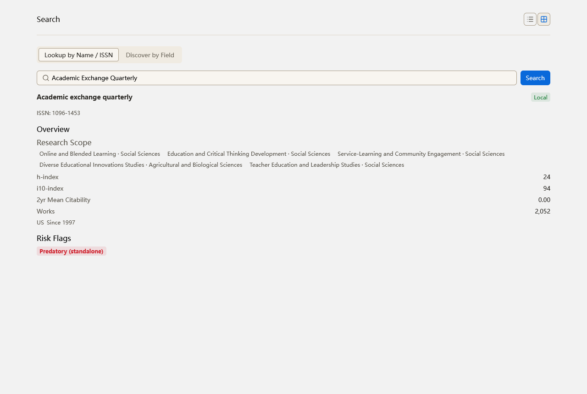
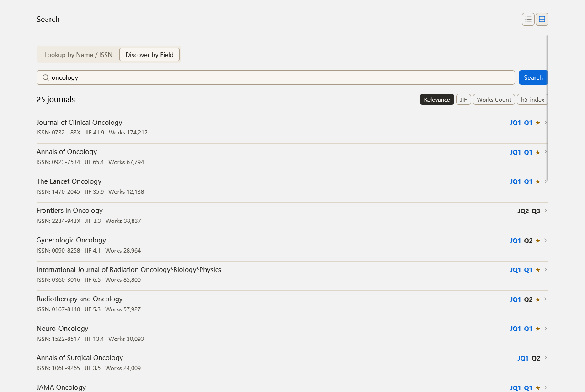

# z-search

**English** | [中文](README.zh-CN.md)

**Academic Search · Web Search · Repository Search · Vector Search — an all-in-one Zotero search plugin.**

z-search is a standalone Zotero plugin that brings every search capability inside
and outside your library into one window: parallel search across academic
databases with one-click import into your library, web-search source management,
GitHub repository search, and in-library vector & full-text search powered by
local or cloud embedding models. Result cards carry built-in journal quality
information — citation count, impact factor, JCR/CASS quartiles, top-journal
flag, international warning list, and predatory-journal markers — all served
from offline databases bundled with the plugin, adding zero network overhead at
query time.

## Installation

1. Download the latest `z-search.xpi` from
   [Releases](https://github.com/Liozhang/z-search/releases);
2. In Zotero: Tools ▸ Plugins ▸ gear menu ▸ Install Plugin From File, and pick
   the downloaded xpi;
3. A magnifier button appears in the toolbar — done. Installed users receive
   upgrades automatically via update.json.

## Result Cards

Every result card is annotated with citation count, impact factor (in yellow),
JCR quartile, CASS major-category quartile, and a top-journal flag; hits on the
international warning list or Beall's predatory-journal list are marked with a
warning badge. Query-term highlighting, on-demand full-text fetching, and
single/batch import all happen on the same card.

## Features

### 1. Academic Search (multi-source parallel + journal quality badges)

- Parallel search across 13 academic sources: OpenAlex, Semantic Scholar,
  Crossref, arXiv, bioRxiv, medRxiv, DOAJ, Zenodo, HAL, CORE, Europe PMC,
  PubMed, and GitHub (all except medRxiv/DOAJ/Zenodo/HAL/GitHub support an
  optional per-source API key)
- Progressive retrieval: requests fan out per source in parallel and results
  render first-come-first-served, so slow sources never hold up fast ones; the
  status bar shows live "X/N sources" progress, partial failures are reported
  explicitly, and empty results are never faked
- Merged, deduplicated results (DOI-normalized), filterable by year range,
  author, journal, sort order, and cap
- Journal quality badges (offline bundled databases, zero network cost):
  - Citation count (per-source figures differ; the larger value wins on merge)
  - Impact factor (highlighted in yellow) and JCR quartile — JCR 2024
  - CASS major-category quartile, subject category, and top-journal flag —
    CASS partition table 2025
  - International warning list and Beall's predatory-journal list (the latter
    only flags exact journal-name matches, with the list's cutoff date shown on
    the badge, to avoid false accusations)
- Single or batch import into your Zotero library (entries without a DOI fall
  back to title→DOI resolution); imports land in the currently selected
  collection, or the My Library root if none
- A "Full Text" button on each card fetches the article on demand —
  PMC open-access JATS XML first (DOI/PMID/PMCID resolution with positive and
  negative caching), open-access web page as fallback, rendered inline
- Abstract translation (Google free endpoint by default; switchable to AI /
  Bing / DeepL / custom engines)
- Copy the result list or export it as CSV

### 2. Journal Metrics Card (verify by name / ISSN)

Type a journal name or ISSN to get a full profile: JCR impact factor and
quartile, CASS major-category quartile, h-index / i10-index / 2-year citation
average / publication volume, subject scope, and founding information. A risk
section surfaces international warning list and predatory-list hits directly —
check a journal before submitting, and screen it before citing, all in one
place. A "discover by field" mode searches journals by research direction.

The discover mode lists journals matching a research field as compact rows —
name, ISSN, JIF, works count, and inline JCR/CAS quartile badges with
top-journal stars — sortable by relevance, JIF, works count, or h5-index;
clicking a row drills into that journal's full metrics card.

### 3. Web Search

- 13 web search sources: DuckDuckGo, Bing(web), Wikipedia, Archive.org
  (no key needed), plus SearXNG, Tavily, Brave, Exa, Serper, SerpAPI, Google,
  Perplexity, and Bing API
- An "enable and test" management panel: runs one real search per source and
  classifies failures (key rejected = auth / network unreachable /
  error), with default-source settings and health-status caching
- Scheduled uniformly by `WebSearchProvider`; the academic review-scan channel
  reuses the same stack

### 4. Repository Search

- GitHub repository search (`api.github.com/search/repositories`, sorted by
  stars, optional `created:` year window); hits map into the unified article
  structure and flow into the academic pipeline
- Personal access token supported to raise rate limits

### 5. Vector Search (in-library)

- In-library semantic search over two vectors lanes — title/abstract metadata
  and PDF full-text chunks — fused and ranked with RRF
- A full-text keyword channel (BM25 + FTS) degrades automatically when vectors
  are unavailable, and the degraded state is visible in the UI
- Find-similar and duplicate-scan anchor tools operate on the items selected in
  the main Zotero window
- Dual embedding backends: local ONNX by default
  (Xenova/multilingual-e5-small, zero configuration) or API mode (embedding
  models from your AI provider); switching models auto-marks stale chunks with
  one-click rebuild
- Index building ships with progress notifications, aggregated skip reasons,
  cancellation, and a watchdog
- Optional local deep-parsing backend (opendataloader, requires Java 11+):
  the jar is not bundled — drop it into `core/pdf/lib/` under the plugin's
  install directory to enable; otherwise basic text extraction or the MinerU
  remote API is used automatically

### Unified Search Page

One input box fans out to both lanes (in-library semantic + external academic),
deduplicates by DOI into a single list, and settles each engine's status bar
independently (ready / searching / degraded / error — failures never masquerade
as empty results), with a windowed result list plus journal search (JCR/CASS
metrics, warning lists, predatory lists, and a discover mode).

## Entry Points

- The magnifier toolbar button, or Tools menu ▸ "Open Search Center", opens the
  search window
- Item context menu ▸ "Find Similar Items" jumps straight to find-similar
- Deep link: `hubWindowManager.openHub("search")`

## Development

Architecture notes, the upstream leadero porting changes, and the
build/test/deploy/release workflows live in
[docs/development.md](docs/development.md).

## License

MIT
