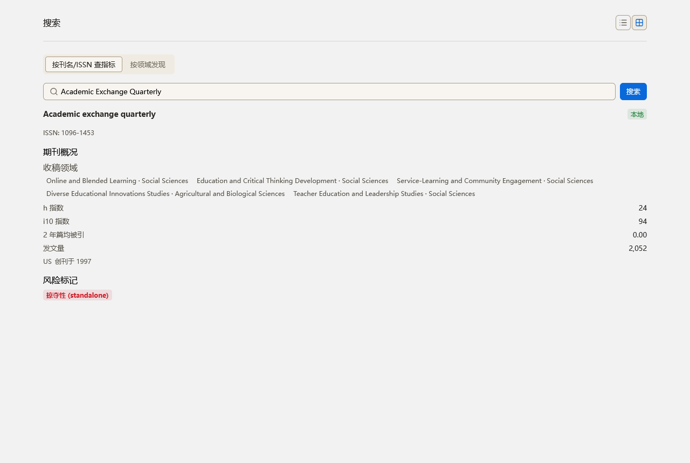

# z-search

**学术搜索 · 网络搜索 · 仓库搜索 · 向量搜索 — 一站式 Zotero 搜索插件。**

z-search 是一个独立的 Zotero 插件，把图书馆内外的全部检索能力收进一个窗口：
外部学术数据库检索并一键导入文献库、网页搜索源管理、GitHub 仓库搜索、
基于本地/云端嵌入模型的库内向量与全文检索。结果卡直接内置期刊质量信息——
引用数、影响因子、JCR/中科院分区、顶刊、国际预警、掠夺性期刊标记，
全部来自随包分发的离线数据库，检索时零额外网络开销。

## 检索结果卡

每条结果直接标注引用数、影响因子（黄字）、JCR 分区、中科院大类分区与
顶刊标记，命中国际预警名单或 Beall's 掠夺性期刊名单时以警示徽章标出；
检索词高亮、全文按需拉取、单条/批量导入都在同一张卡上完成。


## 功能

### 1. 学术检索（多源并联 + 期刊质量徽章）

- 并联检索 13 个学术源：OpenAlex、Semantic Scholar、Crossref、arXiv、
  bioRxiv、medRxiv、DOAJ、Zenodo、HAL、CORE、Europe PMC、PubMed、
  GitHub（除 medRxiv/DOAJ/Zenodo/HAL/GitHub 免 key 外，其余每源独立
  API key 可选配置）
- 渐进式检索：逐源并行发起，先到先上屏，慢源不拖累快源；状态条实时
  显示「X/N 源」进度，部分源失败显式提示，不谎报空结果
- 结果合并去重（DOI 归一化），支持按年份区间、作者、期刊、排序、上限
  等维度筛选
- 期刊质量徽章（离线内置库，随包分发、零网络开销）：
  - 引用数（各源口径不一，合并时取较大值）
  - 影响因子（黄字强调）与 JCR 分区——JCR 2024
  - 中科院大类分区、学科类别与顶刊标记——中科院分区表 2025
  - 国际预警名单、Beall's 掠夺性期刊名单（后者仅精确刊名命中才标记，
    徽章附名单截止时间，避免误伤）
- 单条导入 / 批量导入到 Zotero 文献库（无 DOI 条目走标题→DOI 回退解析），
  导入落到当前选中的分类（无则 My Library 根）
- 结果卡「全文」按钮：按需拉取单篇全文——PMC 开放获取 JATS XML 优先
  （DOI/PMID/PMCID 解析 + 正负缓存），开放获取网页兜底，内联展示
- 摘要翻译（默认 Google 免费端点，可切 AI / Bing / DeepL / 自定义引擎）
- 结果列表复制 / CSV 导出

### 2. 期刊指标卡（按刊名 / ISSN 查证）

输入刊名或 ISSN 即查单刊画像：JCR 影响因子与分区、中科院大类分区、
h 指数 / i10 指数 / 2 年篇均被引 / 发文量、收稿领域与创刊信息；
风险标记区直接给出国际预警与掠夺性名单命中——投稿前查刊、引用前排雷
都在同一处完成。另有「按领域发现」模式按研究方向检索期刊。



### 3. 网络搜索

- 13 个网页搜索源：DuckDuckGo、Bing(web)、Wikipedia、Archive.org（免 key），
  SearXNG、Tavily、Brave、Exa、Serper、SerpAPI、Google、Perplexity、Bing API
- 「启用并测试」管理面：单源真实搜索一次，失败分类（key 被拒 auth /
  网络不可达 unreachable / error），默认源设置，健康状态缓存
- 由 `WebSearchProvider` 统一调度，学术检索的综述扫描（review search）
  复用同栈

### 4. 仓库搜索

- GitHub 仓库检索（`api.github.com/search/repositories`，按 star 排序，
  可选 `created:` 年份窗），命中映射为统一文章结构进入学术检索流
- 支持个人 access token 提升速率限额

### 5. 向量搜索（库内检索）

- 库内语义检索：标题/摘要元数据向量 + PDF 全文分块向量两路，RRF 融合排序
- 全文关键词通道（BM25 + FTS）在向量不可用时自动降级，降级态在 UI 显式可见
- 找相似（find similar）、查重（duplicate scan）锚点工具，作用于 Zotero 主窗
  选中条目
- 嵌入后端双模：本地 ONNX（默认，Xenova/multilingual-e5-small，零配置）
  或 API 模式（接入 AI provider 的 embedding 模型）；模型切换自动标记 stale
  分块并可一键重建
- 索引构建带进度通知、跳过原因聚合、取消与看门狗
- 可选本地深度解析后端（opendataloader，需 Java 11+）：jar 不随包分发，
  手动放入插件安装目录 `core/pdf/lib/` 即启用；未配置时自动走基础文本
  抽取或 MinerU 远程 API

### 统一搜索页

一个输入框并联三条腿（库内语义 + 外部学术），DOI 去重后单一列表，
逐路引擎状态条（就绪/检索中/降级/出错各自结算，失败不谎报空结果），
窗口化结果列表 + 期刊搜索（JCR/CASS 指标、预警名单、掠夺性期刊名单、
发现模式）。

## 构建

```bash
npm install          # 安装依赖
npm run build        # 构建 embed-frame + reactBundle + xpi 产物（.scaffold/build）
npm run build:prod   # 生产构建（压缩、去 console、产 xpi 与 update.json）
npm run build:react  # 只构建 React iframe bundle
npm run check:types  # tsc 双配置类型检查
npm test             # vitest：纯逻辑单测 + 宿主 bundle 冒烟
```

## 部署到本地 Zotero

```bash
npm run rebuild      # = 完整构建 + node scripts/deploy.js：拷贝产物到 profile、
                     # 清缓存、杀掉旧 Zotero、带 -jsconsole 重启
npm run restart      # 只部署重启（不重新构建）
```

profile 路径、Zotero 可执行文件路径在 `scripts/deploy.js` 顶部按本机调整；
工作区有未提交改动时需要 `npm run restart -- --allow-dirty` 放行。

## 测试

```bash
npm test             # vitest：纯逻辑单测（含富集/名单匹配/宿主 bundle 冒烟）
npm run test:zotero  # 真实 Zotero 内集成测试（mocha via zotero-plugin test）：
                     # 开 Hub 窗、验证 iframe React 树渲染、host 桥 RPC 路由、
                     # 结果卡徽章实机视觉核查（真实检索 + 截图落盘
                     # tests/zotero/sdt-out/，输出目录不可用时自动跳过）
```

`test:zotero` 需要通过 `ZOTERO_PLUGIN_ZOTERO_BIN_PATH` 指定本机 zotero.exe
（见 package.json）。集成套件会重建主插件包；改动 React iframe 侧代码后
先 `npm run build:react` 再跑，避免用到过期的 reactBundle。

## 发布

```bash
npm run release      # bump 版本号 → 生产构建 → commit/tag/push（v*）
                     # tag 触发 GitHub Actions：构建 xpi、创建 GitHub Release
                     # 并上传，在 `release` tag 下刷新 update.json（自动更新清单）
```

前置条件：`package.json` 的 `repository.url` 指向真实 GitHub 仓库——
manifest 的 `update_url` 和 xpi 下载地址都由它渲染，占位地址会让自动更新
静默失效。首个发布动作建议先本地跑一次 `npm run build:prod` 确认产物。

## 入口

- Zotero 工具栏按钮（放大镜）或 工具菜单 ▸ 「打开搜索中心」打开搜索窗
- 条目右键菜单 ▸ 「查找相似文献」直达找相似
- 深链：`hubWindowManager.openHub("search" | "sources")`

## 架构

```
src/
├── index.ts / addon.ts / hooks.ts     插件入口（bootstrap 生命周期）
├── core/search/                       搜索引擎层（管线/评分/融合/索引）
├── core/sources/academic-search/      学术源 + GitHub 仓库源适配器
├── core/ai core/embedding             AI provider 栈 + 嵌入（本地/API）
├── core/data                          期刊指标/预警/掠夺性名单数据栈
├── core/translation                   摘要翻译引擎
├── ui/hub/                            Hub 窗口 host 侧（精简 bridge + RPC handler）
├── bridge/                            iframe postMessage 桥（协议 zsearch-req/res/notify）
└── react/                             Hub iframe UI（SearchShell + 搜索面板 + ui kit）

addon/
├── content/hub/                       XUL 宿主窗 + iframe 壳
├── content/chat/react/*.css           设计令牌与 Hub 分区样式（<style> 注入）
├── data/                              JCR/CASS/预警/Bealls 离线数据集
├── prefs.js                           搜索相关偏好默认值
└── locale/                            en-US / zh-CN / zh-TW Fluent 文案
```

## 与 leadero 的差异（移植裁剪）

- 去除：聊天/Agent/深度研究工作流、学术脑、关注追踪、图谱、引用网络、
  阅读器等非搜索功能；搜索页的「知识库腿 / 追踪 / 深度研究」入口随之
  移除（`useMixedSearch` 简化为库内语义 + 外部学术两腿）
- 记忆系统（memory-observer）以轻量桩替代：`DiscoveryEngine` 的研究方向
  积累与库建议特性优雅降级（不报错、返回空）
- 命名空间：`leadero@leadero.dev` → `zsearch@z-search.dev`；DB 表
  `leadero_*` → `zsearch_*`；窗口类型 `leadero:hub` → `zsearch:hub`
- 构建管线：保留 webpack(React) + zotero-plugin-scaffold(addon) +
  esbuild(embed-frame)，去掉 leadero 的 30+ 个 CSS 约定检查脚本

## 许可

MIT
